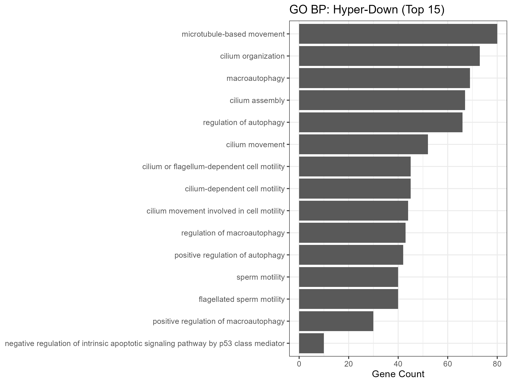

# TNBC Multi-Omics (Bhaskararao Ch)

End-to-end analysis of Triple-Negative Breast Cancer (TNBC) using RNA-seq, DNA methylation, mutations/TMB, and proteomics.  
Multi-omics are integrated via Similarity Network Fusion (SNF) + consensus clustering, validated by survival (KM/Cox) and pathway enrichment (GO/GSVA/PROGENy).  
Model explainability is provided with SHAP.  

*Author:* Bhaskararao Ch (GitHub: Baashi27-ai)  
*License:* MIT  

---

## 🔑 Highlights
- *Integration:* SNF + consensus → stable TNBC subtypes  
- *Biology:* GO/Reactome enrichment; GSVA panels; PROGENy TF activity  
- *Outcomes:* Kaplan–Meier & age-adjusted Cox confirm prognostic separation  
- *Explainability:* SHAP summaries + feature prep scripts  

---

## 📂 Repo Layout
```plaintext
tnbc-multiomics/
│── data/              # Sample input data (sanitized)
│── env/               # Environment reproducibility (YAML, sessionInfo)
│── reports/           # Key reports (slides, quick summary, M1)
│── results/           # Outputs: plots, tables, enrichment, survival
│── src/               # Scripts: RNA-seq, methylation, proteomics, SNF
│── deliverables/      # Final curated figures & presentations
│── .gitignore         # Ignore rules for large/data artifacts
│── LICENSE            # MIT License
│── README.md          # Project overview (this file)

## Key Figures

<p align="center">
  
  
</p>

<p align="center">
  
  
</p>

<p align="center">
  
  
</p>

<p align="center">
  
  
</p>

<p align="center">
  
  
</p>

<p align="center">
  
</p>


