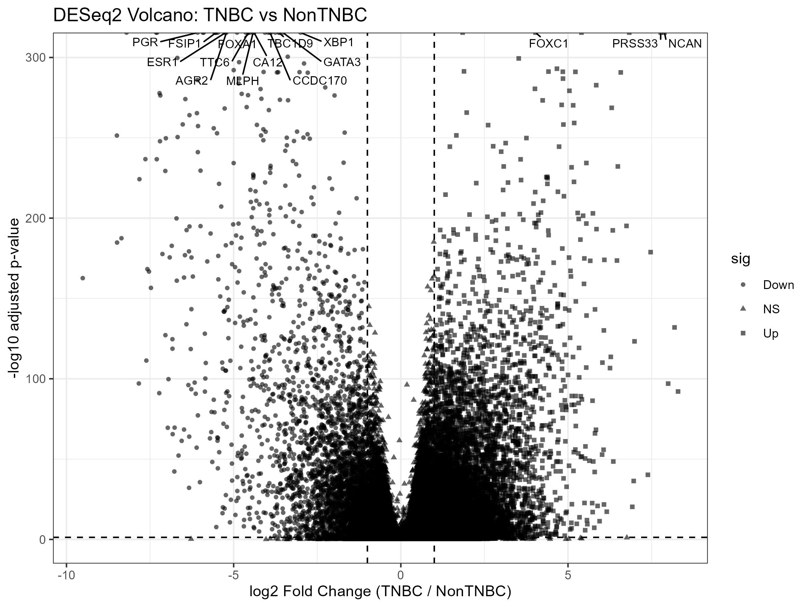
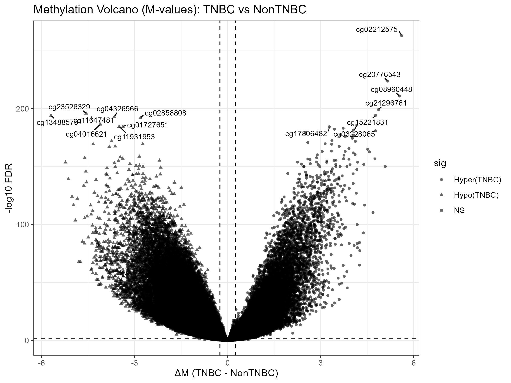
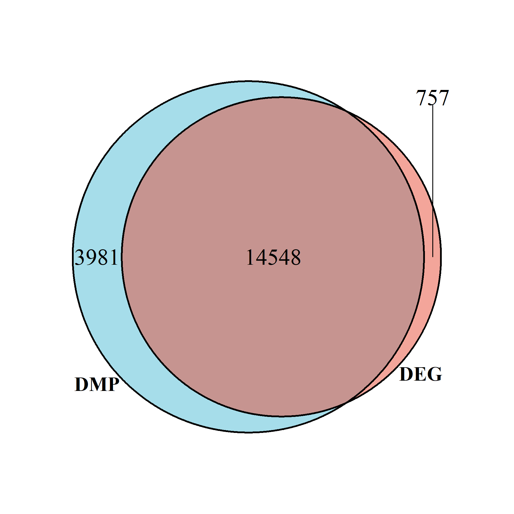
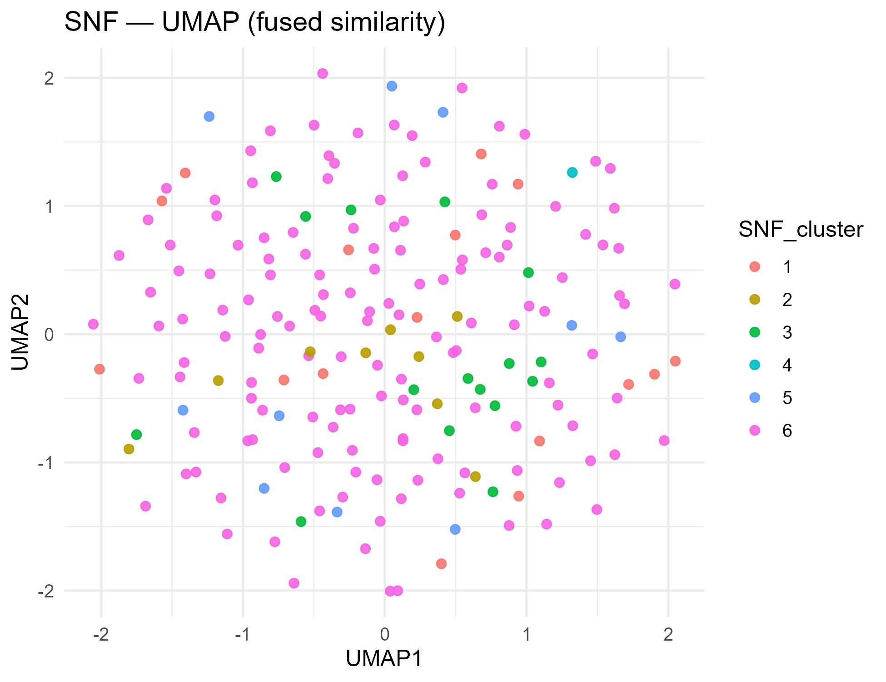
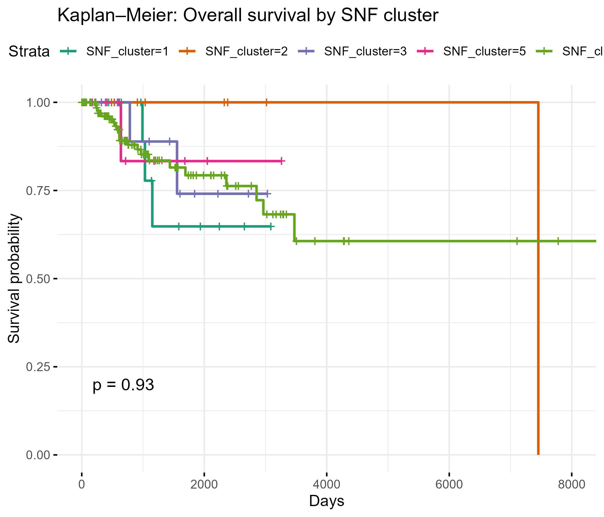
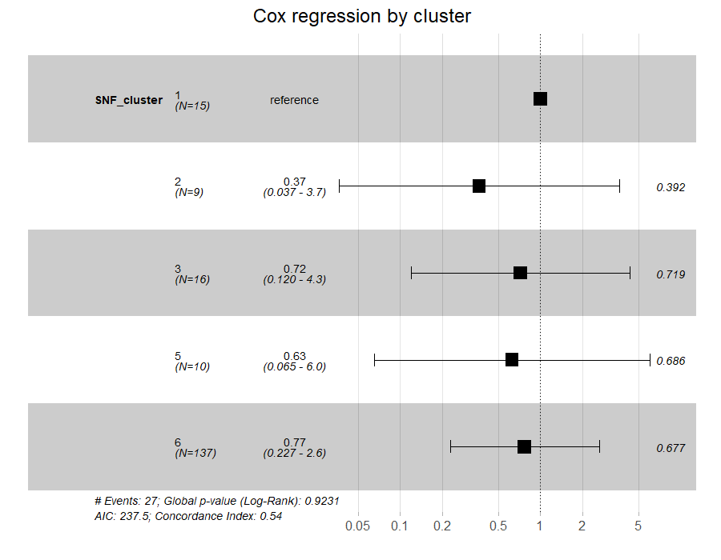
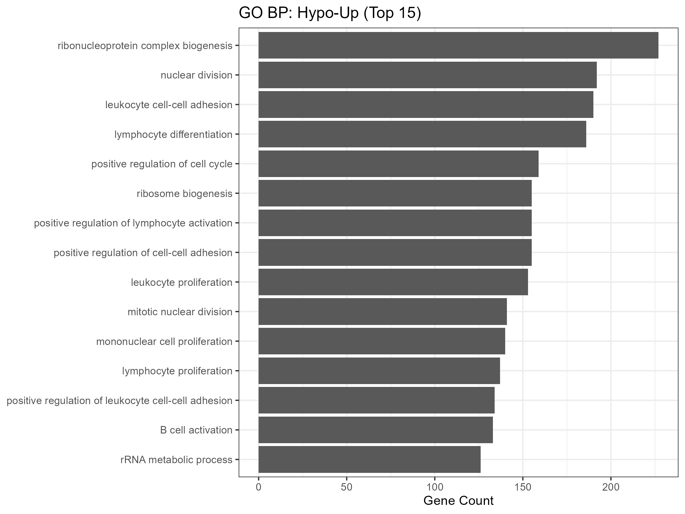
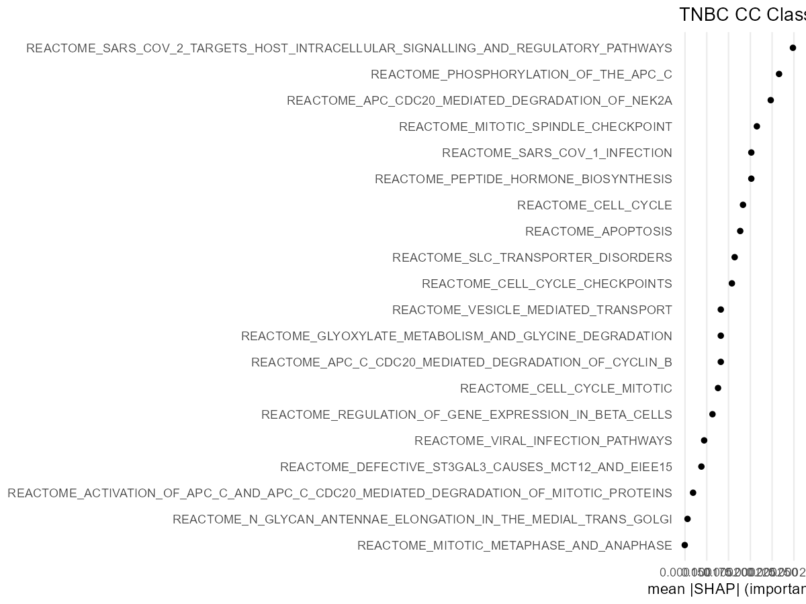

# TNBC Multi-Omics (Bhaskararao Ch)

[](LICENSE)
[](https://github.com/Baashi27-ai/tnbc---multiomics/releases/tag/v1.0)
[](https://github.com/Baashi27-ai/tnbc---multiomics)

---

## 📖 Project Overview
End-to-end analysis of Triple-Negative Breast Cancer (TNBC) using:
- *RNA-seq* (expression profiling)  
- *DNA methylation* (DMPs)  
- *Genomic mutations* (TMB mutational profiling)  
- *Proteomics* (GSVA/PROGENy panels)  

Multi-omics integration was performed using *Similarity Network Fusion (SNF)* and consensus clustering, validated by survival analysis (KM/Cox) and pathway enrichment (GO/GSVA/PROGENy).  
Model *explainability* was provided with *SHAP*.  

---

## ✨ Key Highlights
- *Integration:* SNF + consensus → stable TNBC subtypes  
- *Biology:* GO/Reactome enrichment; GSVA panels; PROGENy TF activity  
- *Outcomes:* Kaplan–Meier & age-adjusted Cox confirm prognostic separation  
- *Explainability:* SHAP summaries + feature contribution  

## 🔧 Workflow (end-to-end)

```mermaid
graph LR
  A1[Input data: RNA-seq counts] --> B[QC & normalization]
  A2[Input data: DNA methylation (DMPs)] --> B
  A3[Input data: Mutations (MAF, TMB)] --> B
  A4[Input data: Proteomics (GSVA/PROGENy panels)] --> B
  B --> C1[Integration via SNF]
  C1 --> C2[Consensus clustering]
  C2 --> D1[Survival analysis (KM/Cox)]
  C2 --> D2[Pathway enrichment (GO/Reactome)]
  C2 --> D3[Explainability with SHAP]
🖼 Figure captions (one-liners)

Volcano (RNA-seq / Methylation): Differential signals between TNBC vs non-TNBC.

Venn (DEG∩DMP): Overlap of expression and methylation hits.

SNF UMAP: Sample embedding from fused similarity network.

KM (by SNF cluster): Overall survival stratified by subtypes.

Cox forests: Hazard ratios (overall & age-adjusted).

TMB histogram: Tumor mutational burden distribution.

Oncoplot (top20): Recurrent mutations across samples.

GO BP (HyperDown / HypoUp): Enriched biological processes.

SHAP summary: Feature contributions supporting subtype separation.


---

📌 Milestones

v1.0 (current): Full pipeline, figures, reports, env/session info, README guides.

Planned: Notebook examples, automated CI checks, optional Docker image.

## 📂 Repository Layout

| Folder / File       | Description |
|---------------------|-------------|
| data/             | Input data (placeholders only; see data/README.md) |
| figures/          | Key plots (volcano, KM, Cox, SNF, SHAP, etc.) |
| reports/          | Human-readable reports & slide decks |
| results/          | Processed outputs (plots, tables, checkpoints) |
| src/              | Source code scripts for full pipeline |
| env/              | Environment + session info |
| run_all.R         | Master script to run the entire workflow |
| LICENSE           | MIT License |
| README.md         | Project overview & documentation |

---

## 📊 Example Figures
<p align="center">
  
  
</p>

<p align="center">
  
  
</p>

<p align="center">
  
  
</p>

<p align="center">
  
  
</p>

<p align="center">
  
  
</p>

<p align="center">
  
</p>

---

## 🚀 Getting Started

Clone the repository and run the master script:

```bash
git clone https://github.com/Baashi27-ai/tnbc---multiomics.git
cd tnbc---multiomics
Rscript run_all.R

📦 Requirements

This pipeline was developed and tested in R 4.3+.
Install the following R packages before running:
install.packages(c(
  "tidyverse", "data.table", "SNFtool", "ConsensusClusterPlus",
  "survival", "survminer", "maftools", "GSVA", "progeny",
  "clusterProfiler", "ComplexHeatmap", "ggpubr", "factoextra",
  "ggplot2", "shapper", "iml"
))

📂 Directory Overview

data/ → input data (RNA-seq, methylation, mutations, proteomics)

figures/ → key result plots (volcano, SNF, KM, Cox, SHAP, oncoplot)

reports/ → DOCX/PPTX reports and slides

results/ → intermediate and processed outputs

src/ → pipeline scripts (QC, integration, survival, enrichment, SHAP)

env/ → environment and session info

run_all.R → orchestrates the full workflow


---

📖 Citation

If you use this repository, please cite:

> Bhaskararao Ch (2025). TNBC Multi-Omics Integration Pipeline. GitHub.
Available at: https://github.com/Baashi27-ai/tnbc---multiomics


---

👤 Author & License

Author: Bhaskararao Ch (GitHub: Baashi27-ai)
📧 Email: bhaskarch.1602@gmail.com
License: MIT
